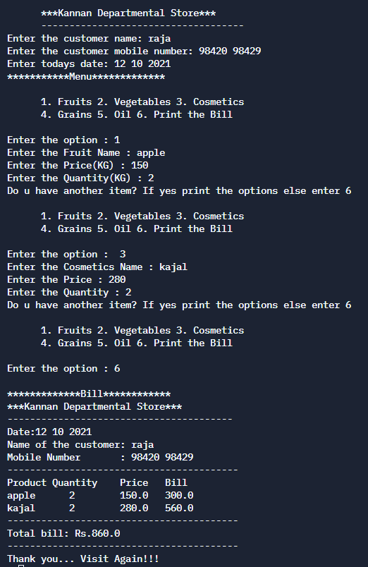

# Reatail Bill Genration


## Table of Contents

- [Problem Statement](#problem-statement)
- [Python Code](#python-code)
- [Sample Output](#Sample-Output)
- [Replit Link](#replit-link)
- [PythonTutor Link](#pythontutor-link)


## Problem Statement

<div align="justify"> <p> To Genrate a Reatail billing software in python.It is a management software and a type of application developed for customer invoicing. At the same time, it's also used to track bills and monitor billing for your customers</div></p>


## Python Code

```python
# get input here
print("\t\tWelcome to \n      ***Kannan Departmental Store***")
print("      ------------------------------------")
name=input("Enter the customer name: ")
mobile=input("Enter the customer mobile number: ")
date=input("Enter todays date: ")


bill_amount=0
Items=[]
ItemQty=[]
ItemPrice=[]
Discount=0


print("***********Menu*************")
print('''
      1. Fruits 2. Vegetables 3. Cosmetics
      4. Grains 5. Oil 6. Exit
      ''')
op=0
#op=int(input("Enter the option : "))
while int(input("Enter the option : ")) in [1,2,3,4,5]:
  if op==1:
      FruitName=(input("Enter the Fruit Name : "))
      Items.append(FruitName)
      FruitPrice=float(input("Enter the Price(KG) : "))
      ItemPrice.append(FruitPrice)
      FruitQty=int(input("Enter the Quantity(KG) : "))
      ItemQty.append(FruitQty)
  if op==2:
      VegetableName=(input("Enter the Vegetable Name : "))
      Items.append(VegetableName)
      VegetablePrice=float(input("Enter the Price(KG) : "))
      ItemPrice.append(VegetablePrice)
      VegetableQty=int(input("Enter the Quantity(KG) : "))
      ItemQty.append(VegetableQty)
  if op==3:
      CosmeticName=(input("Enter the Cosmetics Name : "))
      Items.append(CosmeticName)
      CosmeticPrice=float(input("Enter the Price : "))
      ItemPrice.append(CosmeticPrice)
      CosmeticQty=int(input("Enter the Quantity : "))
      ItemQty.append(CosmeticQty)
  if op==4:
      GrainName=(input("Enter the Grain Name : "))
      Items.append(GrainName)
      GrainPrice=float(input("Enter the Price(KG) : "))
      ItemPrice.append(GrainPrice)
      GrainQty=int(input("Enter the Quantity(KG) : "))
      ItemQty.append(GrainQty)
  if op==5:
      OilName=(input("Enter the Oil Name : "))
      Items.append(OilName)
      OilPrice=float(input("Enter the Price(KG) : "))
      ItemPrice.append(OilPrice)
      OilQty=int(input("Enter the Quantity(Ltr) : "))
      ItemQty.append(OilQty)
  
  print("Do u have another item? If yes print the options else enter 6")
  print('''
      1. Fruits 2. Vegetables 3. Cosmetics
      4. Grains 5. Oil 6. Print the Bill
      ''')
  op=int(input("Enter the option : "))


print("\n*************Bill************")
print("***Kannan Departmental Store***")
print("----------------------------------------")
print("Date:%s"%date)
print("Name of the customer: %-20s"%name)
print("Mobile Number       : %2s"%mobile)
print("-----------------------------------------")

print("Product\tQuantity\tPrice\tBill")
for IC in range(len(Items)):
  # print("{0:<10} {1:<8} {2:<7} {3:<3}".format(Items[IC],ItemQty[IC],ItemPrice[IC],ItemPrice[IC]*ItemQty[IC]))
  print("{}    {}    {}    {}".format(Items[IC],ItemQty[IC],ItemPrice[IC],ItemPrice[IC]*ItemQty[IC]))
  bill_amount+=(ItemPrice[IC]*ItemQty[IC])
  
print("-----------------------------------------")

print(f"Total bill: Rs.{bill_amount}")
print("-----------------------------------------")


print("Thank you... Visit Again!!!")


# check the condition
    
```

## Sample Output


## Replit Link
https://tinyurl.com/2p8nmxmj


## PythonTutor Link

https://tinyurl.com/2p8ust32
