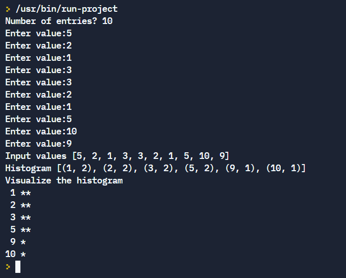

# Students marks statement


## Table of Contents

- [Problem Statement](#problem-statement)
- [Python Code](#python-code)
- [Sample Output](#Sample-Output)
- [Replit Link](#replit-link)
- [PythonTutor Link](#pythontutor-link)


## Problem Statement

<div align="justify"> <p> Write a program to calculate grade point average (GPA) and generate a GPA report using Sequence Data types in python  </div></p>


## Python Code

```python

    
```

## Sample Output


## Replit Link
https://tinyurl.com/HistogramRepl

## PythonTutor Link

https://tinyurl.com/HistogramVisualize
