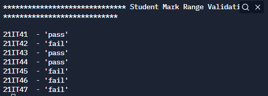

# Mark Range Validation


## Table of Contents

- [Problem Statement](#problem-statement)
- [Python Code](#python-code)
- [Sample Output](#Sample-Output)
- [Replit Link](#replit-link)


## Problem Statement

<div align="justify"> <p> To Validate the student grade based on marks secured by the individual student </div></p>


## Python Code


```python
import re
print(f"{'*'*30} Student Mark Range Validation {'*'*30}\n")
try :
    fo=open('studentmarklist.txt','r')
    studentmarklist=fo.readlines()
    error=None
except IOError as e:
    error=e
finally:
    if not error:
        for student in studentmarklist[1:]:
            RollNumber,Name,MarksPercentage=tuple(re.findall('\w+',student))
            if int(MarksPercentage)>70:
                print(RollNumber," - 'pass'")
            else:
                print(RollNumber," - 'fail'")
    else:
        print(error)

```
`

## Sample Output


## Replit Link
https://tinyurl.com/mrfj3cdk


