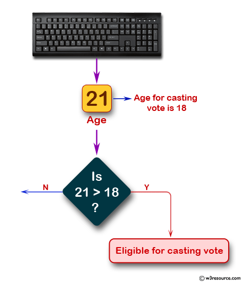
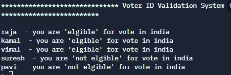

# Read Lines from a file



## Table of Contents

- [Problem Statement](#problem-statement)
- [Python Code](#python-code)
- [Sample Output](#Sample-Output)
- [Replit Link](#replit-link)


## Problem Statement

<div align="justify"> <p>  Read the input file which contains names and age.Check the condition, whether age is greater than or equal to 18 or not - if age is greater than or equal to 18, the person will be eligible for the voting.  </div></p>


## Python Code

```python
print(f"{'*'*30} Voter ID Validation System {'*'*30}\n")
try :
    fo=open('peoplelist.txt','r')
    peoplelist=fo.readlines()
    error=None
except IOError as e:
    error=e
except NameError as e:
    error=e
finally:
    if not error:
        for people in peoplelist:
            name,age=people.split(' ')
            if int(age)>=18:
                print(name," - you are 'elgible' for vote in india")
            else:
                print(name," - you are 'not elgible' for vote in india")
    else:
        print(error)

```
```text
peoplelist.txt
 raja 31
 kamal 45
 vimal 98
 suresh 17
 pavi 5
 ```

## Sample Output


## Replit Link
https://tinyurl.com/2p8ax74e


