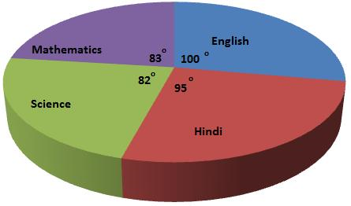
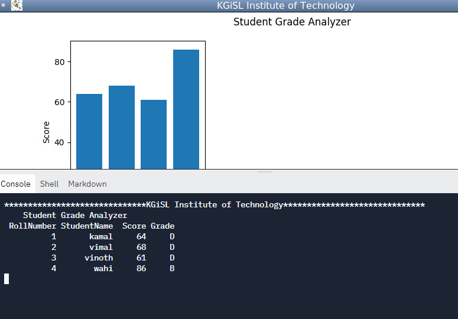

# Students marks statement



## Table of Contents

- [Problem Statement](#problem-statement)
- [Python Code](#python-code)
- [Sample Output](#Sample-Output)
- [Replit Link](#replit-link)
- [PythonTutor Link](#pythontutor-link)


## Problem Statement

<div align="justify"> <p> Write a program to calculate grade point average (GPA) and generate a GPA report using Sequence Data types in python  </div></p>


## Python Code

```python
import os
os.environ['MPLCONFIGDIR'] = os.getcwd() + "/configs/"
import pandas as pd
import numpy as np
import matplotlib.pyplot as plt


d = {
    'RollNumber':[1,2,3,4],                                
    'StudentName':['kamal','vimal','vinoth','wahi'],    
    'Score':[64,68,61,86]}
df = pd.DataFrame(d)   

# converting dict to dataframe
# Keys get converted to column names and values to column values

#get grade by adding a column to the dataframe and apply np.where(), similar to a nested if

df['Grade'] = np.where((df.Score < 60 ), 
                  'F', np.where((df.Score >= 60) & (df.Score <= 69), 
                  'D', np.where((df.Score >= 70) & (df.Score <= 79), 
                  'C', np.where((df.Score >= 80) & (df.Score <= 89), 
                  'B', np.where((df.Score >= 90) & (df.Score <= 100), 
                  'A', 'No Marks')))))
df_no_indices = df.to_string(index=False)
print(f"{'*'*30}KGiSL Institute of Technology{'*'*30}")
print('\tStudent Grade Analyzer')
print(df_no_indices)
#print(df)

#Graphical Representation using Matplotlib

rollnumber=d['RollNumber']
names = d['StudentName']
values = d['Score']

#fig = plt.figure("YourWindowName")
fig=plt.figure("KGiSL Institute of Technology")
fig.set_figheight(4)
fig.set_figwidth(10)
plt.subplot(131)
plt.bar(names, values)
plt.ylabel('Score')
plt.xlabel('Student Names')
plt.suptitle('Student Grade Analyzer')
plt.show()

    
```

## Sample Output


## Replit Link
https://tinyurl.com/umr44fd4


## PythonTutor Link

https://pythontutor.com/visualize.html#mode=edit

